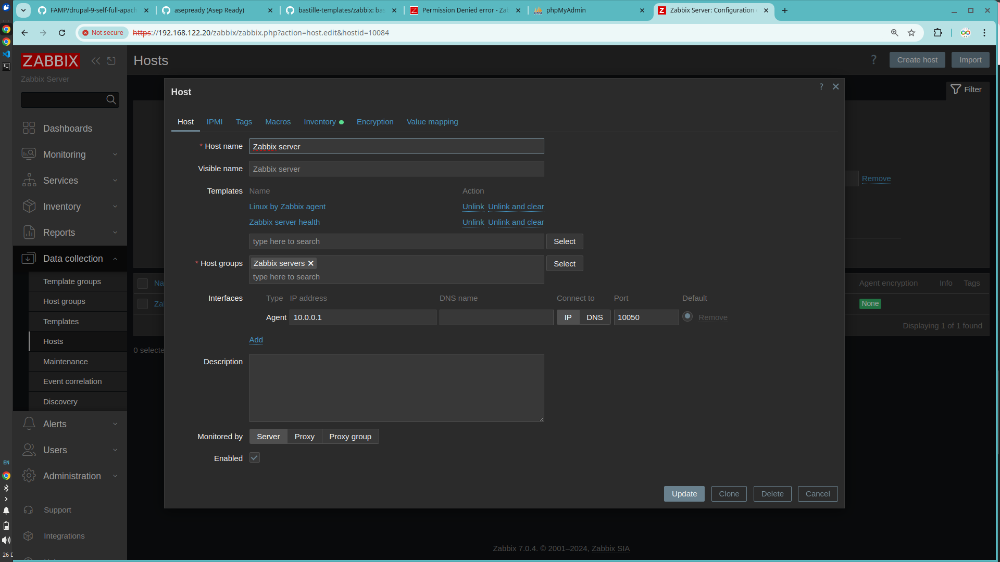

## Now apply template to container
```sh
bastille create zabbix 14.1-RELEASE YourIP-Bastille

bastille bootstrap https://github.com/bastille-templates/zabbix
bastille template zabbix bastille-templates/zabbix
```

## License
This project is licensed under the BSD-3-Clause license.

## Fix Error
Login your container
```sh
root@bastille:~ # bastille console zabbix 
root@zabbix:~ # cat db_zabbix_pwd.txt #display your password generate db zabbix
my16ZspzKVJZl2gz
root@zabbix:~ # sed -i '' 's%DBPassword=$DBZABBIX_PASSWD%DBPassword=my16ZspzKVJZl2gz%g' /usr/local/etc/zabbix7/zabbix_server.conf
root@zabbix:~ # service zabbix_server restart #restart your service
```
Change IP Server Agents your container

